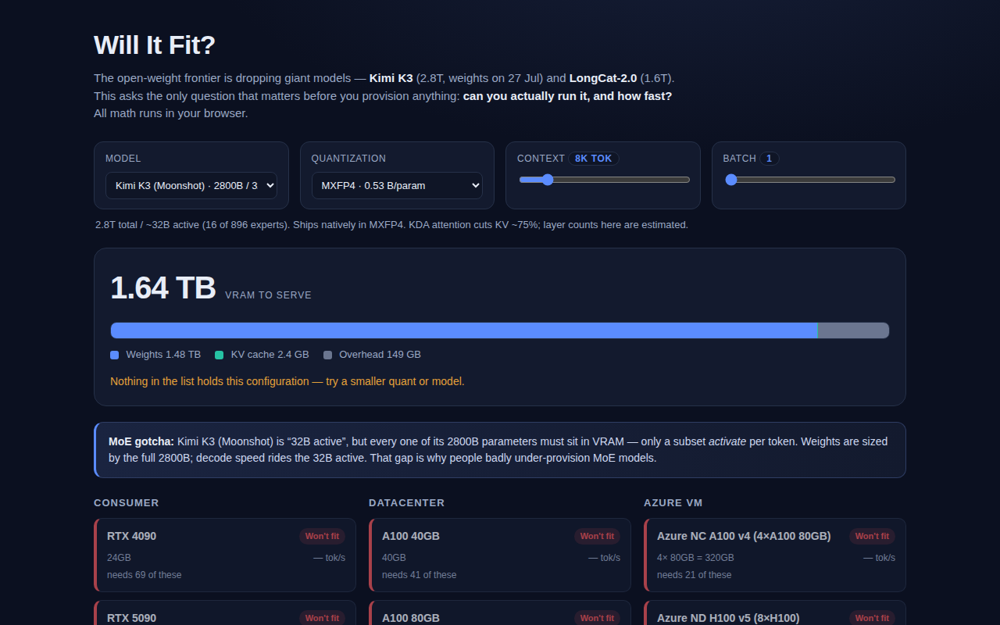

<div align="center">

# Will It Fit?

**Pick an open-weight LLM (Kimi K3, LongCat-2.0, GPT-OSS…), a quantization, and your GPU or Azure VM — instantly see if it fits in VRAM and how fast it decodes. 100% in your browser, no API key.**

[](https://github.com/kbipul/will-it-fit/actions/workflows/ci.yml)
[](https://kbipul.github.io/will-it-fit/)

`Day 15` of **[kb-daily-builds](https://github.com/kbipul/kb-daily-builds)** — one AI project a day.

</div>

## What it does

Two enormous open-weight models landed in the same week: Kimi K3 (2.8T params, 1M context, weights dropping 27 Jul 2026) and LongCat-2.0 (1.6T). The moment weights like that land, everyone asks the same practical question. Can I actually run this, and on what? Will It Fit? answers it before you provision a single GPU.

Pick a model, a quantization, and a context length. The app computes the real VRAM footprint (weights + KV cache + overhead) and lights up a grid of consumer GPUs, datacenter cards, and Azure VM SKUs as **Fits / Tight / Multi-GPU / Won't fit**, each with a memory-bandwidth-bound decode-throughput estimate.



<sub>The screenshot is captured automatically by this repo's CI on a GitHub runner and committed to `docs/demo.png` a few minutes after publish — the build sandbox can't run a browser, so it is never faked.</sub>

## Try it

**[Live demo →](https://kbipul.github.io/will-it-fit/)** runs fully in your browser. Nothing to install, no key.

```bash
git clone https://github.com/kbipul/will-it-fit.git
cd will-it-fit
npm ci
npm run dev      # open the printed localhost URL
npm test         # 15 unit tests over the sizing + fit math
```

## How it works

Three pure functions in `src/lib/calc.ts`, each unit-tested, do all the reasoning:

```
memoryFootprint(model, quant, ctx, batch)
   weights  = totalParams × bytesPerParam        ← ALL experts, even in MoE
   kvCache  = 2 × layers × (hidden ÷ GQA) × ctx × batch × 2B
   overhead = 10% of weights + 1GB
evaluateFit(mem, hardware)  → Fits | Tight | Multi-GPU | Won't fit  (+ GPUs needed)
throughput(model, quant, hw) → tok/s ≈ bandwidth ÷ (activeParams × bytesPerParam)
```

A Mixture-of-Experts model is sized by its total parameter count. Its active count sizes something else entirely: decode speed. Kimi K3 is marketed as "32B active", but all 2.8T weights have to sit in VRAM; only 16 of its 896 experts activate per token. So `memoryFootprint` multiplies `totalParamsB` and `throughput` multiplies `activeParamsB`, and the two answers diverge by a factor of nearly a hundred. That split is why MoE models get badly under-provisioned, and the app calls it out explicitly.

`evaluateFit` is blunter than it looks. It compares the total against `nodeVram(hw)`, which is just per-card VRAM times accelerator count. Anything over that is `no`. Anything needing more than one card inside the node is `multi`. Anything leaving less than 10% headroom is `tight`.

## Build notes

I set out to build a cost calculator and ended up building a humility machine.

The first surprise came from writing the MoE test. Kimi K3 in its native MXFP4 (0.53 bytes/param) is 2800 × 0.53 ≈ 1,484 GB of weights alone. My gut said an 8×MI300X box has 1,536 GB, so it'll just fit. Add the ~10% activation/framework overhead and you're at ~1,634 GB, and it doesn't fit on a single 8-GPU node at all. I'd written the assertion expecting `multi`. The code returned `no`. I changed the test, not the math. That case now ships under the name "even an 8×MI300X Azure node (1536GB) can't hold Kimi K3 at MXFP4 once overhead is counted".

Throughput is the classic back-of-envelope. Decode is memory-bandwidth bound, so tok/s ≈ bandwidth ÷ active-bytes-per-token. `throughput()` then scales that by a realized-bandwidth factor of 0.8 on a single accelerator, discounted to 70% efficiency across several, which is where tensor-parallel communication gets absorbed. It's deliberately labelled an estimate: paged KV and KV quantization both move the real number, and neither is modelled here. What the estimate does get right is the shape of the trade-off, that a 120B MoE with 5B active out-decodes a dense 405B on the very same H100. There's a test for that exact comparison.

Keeping it a pile of pure functions paid off twice. The 15 Vitest cases run in 2 ms, which is what gave me the nerve to trust a counter-intuitive result over my own intuition. And the whole thing ships as a static page with zero model download, so the live demo never spins a loader. As an IT Director this is the layer I actually care about: not "look, a model," but "here's the VM SKU you provision and the token rate you'll get for it."

## Where the numbers get soft

The KV-cache term is where honesty gets hard. The exact per-model head geometry for brand-new releases isn't fully public yet, so the cache is modelled from `hiddenSize / gqaFactor` at `KV_BYTES_DEFAULT = 2` bytes per element. In `models.ts` I have Kimi K3 down as 72 layers, hidden size 8192, GQA factor 8. I don't know that any of those three are right. Its KDA attention and LongCat's expert layout are both partly guesswork on my side, and the file says so in its own notes.

That's why every architecture field is editable in the UI. The calculator's arithmetic is exact; the inputs for a six-day-old model are not gospel. Kimi K3's own KDA reportedly cuts KV by ~75%. I didn't hard-code that discount. I can't verify it, and I'd rather you dial the context and watch the cache term move than trust a factor I copied off a launch post. If the real geometry differs, the Kimi K3 rows here move with it, and I have no way to check until the weights are out on 27 Jul 2026.

## Stack

| Layer | Choice |
|---|---|
| UI | React 18 + TypeScript 5 |
| Build | Vite 6 (`base: /will-it-fit/` for Pages) |
| Tests | Vitest (15 cases over the sizing/fit/throughput math) |
| Data | Curated model, quant, GPU & Azure-VM tables, all editable, no backend |

---

<div align="center"><sub>
Built by <a href="https://www.kumarbipul.com"><b>Kumar Bipul</b></a> ·
IT Director → AI/ML · <a href="https://github.com/kbipul">github.com/kbipul</a>
</sub></div>
